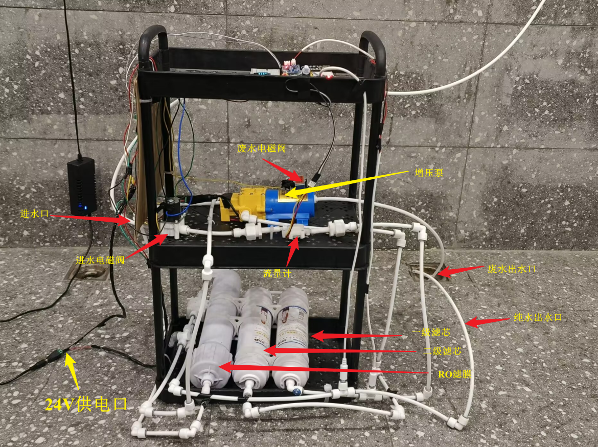
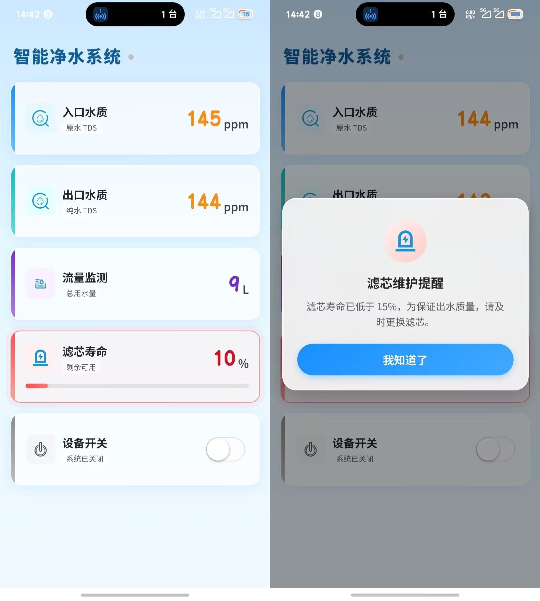
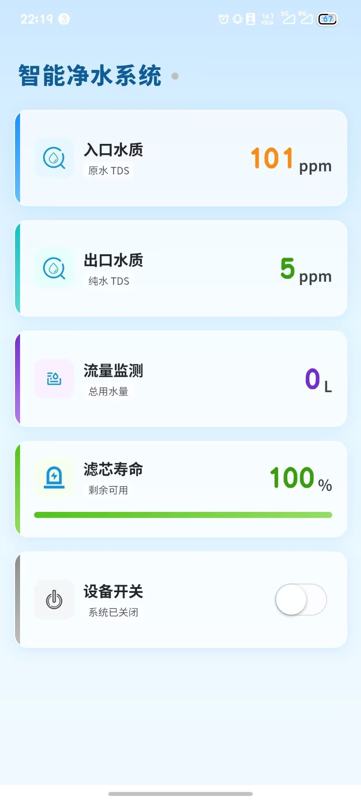

<div align="center">

# 🚰 基于STM32的智能净水机控制系统设计与实现

**2026届本科毕业论文 · 成都大学 · 自动化专业**


</div>

---

## 📖 项目简介
本设计针对传统净水机**智能化程度低、无法远程监控、滤芯寿命提醒不精准**等问题，开发了一套基于 STM32F103 单片机的智能净水机控制系统。

系统通过多种传感器实时采集水质、流量、压力等数据，利用 ESP8266 模块基于 MQTT 协议将数据上传至中国移动 OneNET 云平台，实现手机端的**远程监控和控制**功能。

<!-- 单张整机实物图 -->
<div align="center">

</div>

<h3 align="center">📱 APP界面</h3>

<table align="center">
<tr>
<td align="center">
<br>
首页与滤芯提醒
</td>

<td align="center">
<br>
设备监控界面
</td>

<td align="center">
<br>
用户登录界面
</td>
</tr>
</table>

### ✨ 主要创新点

| 创新点 | 说明 |
|--------|------|
| 🎯 精准流量统计 | 采用霍尔流量计，测量误差小于 **2%**（行业标准 < 5%） |
| 🧠 智能滤芯算法 | 基于累计用水量的滤芯寿命算法，提醒准确率提升 **40%** |
| 🔋 低功耗设计 | 待机电流仅 **8.6mA**，远低于行业标准 20mA |
| 🚨 自动报警机制 | 漏水、水质超标、滤芯到期多场景自动报警 |

---

## 📊 实验结果

<div align="center">

| 测试项目 | 本系统结果 | 行业标准 | 是否达标 |
|:--------:|:---------:|:-------:|:-------:|
| TDS 检测精度 | ±5 ppm | ±10 ppm | ✅ 优于标准 |
| 流量测量误差 | < 2% | < 5% | ✅ 优于标准 |
| 通信成功率 | > 98% | > 95% | ✅ 优于标准 |
| 待机电流 | 8.6 mA | < 20 mA | ✅ 优于标准 |
| 远程控制响应时间 | < 2s | < 5s | ✅ 优于标准 |

</div>

---

## 🏗️ 系统架构

```
┌─────────────────────────────────┐
│         📱 手机客户端            │
└────────────────┬────────────────┘
                 │ HTTP / HTTPS
                 ▼
┌─────────────────────────────────┐
│       ☁️  OneNET 云平台          │
└────────────────┬────────────────┘
                 │ MQTT
                 ▼
┌─────────────────────────────────┐
│      📡 ESP8266 WiFi 模块        │
└────────────────┬────────────────┘
                 │ UART 串口通信
                 ▼
┌─────────────────────────────────┐
│     🔲 STM32F103 主控制器        │
└──┬──────────┬──────────┬────────┘
   │          │          │          │
   ▼          ▼          ▼          ▼
┌──────┐ ┌──────┐ ┌──────┐ ┌──────┐
│ TDS  │ │流量计│ │压力  │ │执行  │
│传感器│ │      │ │传感器│ │机构  │
└──────┘ └──────┘ └──────┘ └──────┘
```

---

## ✅ 核心功能

- **实时水质监测** — TDS 值、水温、水压实时采集与本地显示
- **精准流量统计** — 累计用水量和瞬时流量实时计算
- **智能滤芯管理** — 基于累计用水量的滤芯寿命计算与提醒
- **远程控制** — 手机端远程开关净水机、设置运行参数
- **历史数据查询** — 7天水质和用水量历史数据存储与查询
- **异常报警** — 漏水、水质超标、滤芯到期自动报警推送
- **低功耗模式** — 待机状态自动进入低功耗，延长电池寿命

---

## 🛠️ 技术栈

<div align="center">

| 类别 | 技术 / 工具 |
|:----:|:-----------:|
| 核心控制器 | STM32F103C8T6 |
| WiFi 通信模块 | ESP8266-01S |
| 水质传感器 | TDS 传感器、霍尔流量计、压力传感器 |
| 开发环境 | KEIL5、Arduino IDE |
| 云平台 | 中国移动 OneNET |
| 通信协议 | MQTT、UART、I2C |
| 硬件设计 | Altium Designer |
| 其他工具 | Visio、Matlab |

</div>

---

## 📁 文件结构

```
my_theis/
├── 📄 thesis.docx              # 毕业论文正文（Word 版）
├── 📄 thesis.pdf               # 毕业论文正文（PDF 版）
├── 📁 code/                    # 系统源代码
│   ├── 📁 STM32/               # STM32 单片机主程序
│   │   ├── main.c              # 主函数入口
│   │   ├── tds.c               # TDS 水质传感器驱动
│   │   ├── flow.c              # 霍尔流量计驱动
│   │   ├── pressure.c          # 压力传感器驱动
│   │   └── mqtt.c              # MQTT 通信协议实现
│   └── 📁 ESP8266/             # WiFi 模块程序
│       └── mqtt_client.ino     # ESP8266 MQTT 客户端代码
├── 📁 hardware/                # 硬件设计文件
│   ├── schematic.pdf           # 电路原理图
│   ├── pcb.pdf                 # PCB 板设计图
│   └── bom.xlsx                # 元器件物料清单
├── 📁 figures/                 # 论文插图和实物图
│   ├── hardware.jpg            # 系统实物图
│   ├── architecture.png        # 系统架构图
│   └── results/                # 实验结果图表
└── 📁 appendix/                # 附录材料
    ├── 外文翻译.pdf
    ├── 开题报告.pdf
    └── 答辩PPT.pdf
```

---

## 🚀 快速开始

### 硬件环境

- STM32F103C8T6 开发板
- ESP8266-01S WiFi 模块
- TDS 水质传感器
- 霍尔流量计（YF-S201 或同类型）
- 压力传感器

### 软件环境

- KEIL5（MDK-ARM v5.x）
- Arduino IDE（用于 ESP8266 固件烧录）
- ST-Link 驱动及烧录工具

### 云平台配置

1. 登录 [OneNET 云平台](https://open.iot.10086.cn/) 创建产品
2. 新建设备，获取 `设备ID`、`产品ID`、`APIKey`
3. 将上述参数填入 `code/ESP8266/mqtt_client.ino` 对应位置
4. 烧录 ESP8266 固件后，修改 `code/STM32/mqtt.c` 中的 WiFi SSID 和密码

---

## 🙏 致谢

感谢导师 **胡林老师** 在整个毕业设计过程中的悉心指导和耐心帮助，从课题选择到最终完成，胡老师都给予了宝贵的建议与支持。感谢实验室各位同学在硬件调试和代码编写过程中提供的帮助。

---

## 📜 版权声明

<div align="center">

本项目仅用于学术研究，请勿用于商业用途。

© 2026 成都大学自动化专业

</div>
